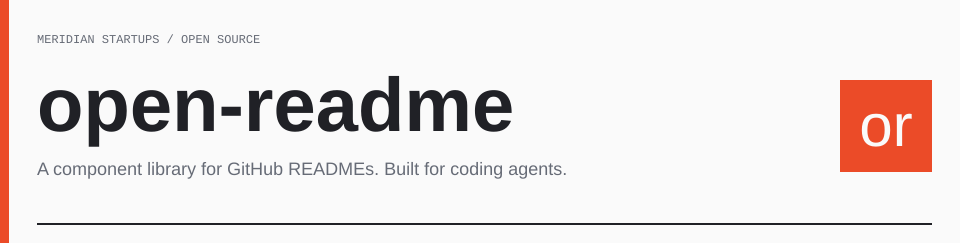
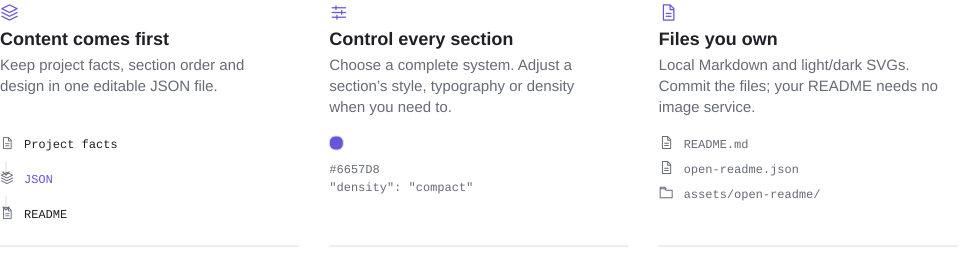
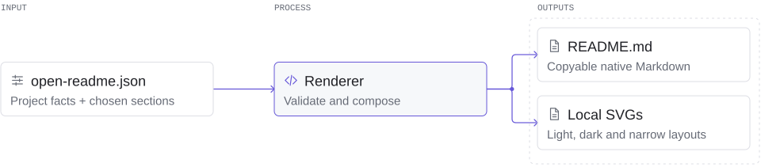

<!-- Generated with open-readme. Edit the JSON configuration to regenerate. -->

<picture>
  <source media="(prefers-color-scheme: dark) and (max-width: 840px)" srcset="assets/open-readme/hero-dark-mobile.svg">
  <source media="(max-width: 840px)" srcset="assets/open-readme/hero-light-mobile.svg">
  <source media="(prefers-color-scheme: dark)" srcset="assets/open-readme/hero-dark.svg">
  
</picture>

[Component library](<https://luc3xhj.github.io/open-readme/>) · [Agent skill](<./skills/open-readme/SKILL.md>) · [Section guide](<./docs/sections.md>) · [Configuration](<./docs/configuration.md>)

<a href="./LICENSE">
<picture>
  <source media="(prefers-color-scheme: dark) and (max-width: 840px)" srcset="assets/open-readme/status-1-dark-mobile.svg">
  <source media="(max-width: 840px)" srcset="assets/open-readme/status-1-light-mobile.svg">
  <source media="(prefers-color-scheme: dark)" srcset="assets/open-readme/status-1-dark.svg">
  
</picture>
</a>
<picture>
  <source media="(prefers-color-scheme: dark) and (max-width: 840px)" srcset="assets/open-readme/status-2-dark-mobile.svg">
  <source media="(max-width: 840px)" srcset="assets/open-readme/status-2-light-mobile.svg">
  <source media="(prefers-color-scheme: dark)" srcset="assets/open-readme/status-2-dark.svg">
  
</picture>
<picture>
  <source media="(prefers-color-scheme: dark) and (max-width: 840px)" srcset="assets/open-readme/status-3-dark-mobile.svg">
  <source media="(max-width: 840px)" srcset="assets/open-readme/status-3-light-mobile.svg">
  <source media="(prefers-color-scheme: dark)" srcset="assets/open-readme/status-3-dark.svg">
  
</picture>

## Choose the parts that help

<picture>
  <source media="(prefers-color-scheme: dark) and (max-width: 840px)" srcset="assets/open-readme/features-dark-mobile.svg">
  <source media="(max-width: 840px)" srcset="assets/open-readme/features-light-mobile.svg">
  <source media="(prefers-color-scheme: dark)" srcset="assets/open-readme/features-dark.svg">
  
</picture>

## Quick start

```sh
npm install --save-dev github:luc3xhj/open-readme#v0.1.0
npx open-readme init --project cli --design swiss
npx open-readme render --out README.preview.md --json
```

Replace the starter’s instructions with verified project content. Review the preview, then commit the Markdown and assets together. Installation is from GitHub; the npm package is not published yet.

## Use with your agent

Load [skills/open-readme/SKILL.md](./skills/open-readme/SKILL.md), then ask:

> Use open-readme for this repository. Inspect the project, choose useful sections, and show me two component compositions. Keep commands copyable, use a real demo image if available, and omit unsupported claims. Render to README.preview.md first.

The agent can inspect the catalog and section guide through the CLI:

```sh
npx open-readme catalog --json
npx open-readme sections --json
npx open-readme audit --config open-readme.json --json
# Update one marked region while preserving manual content:
npx open-readme render --block hero --section header --out README.md
```

## How it fits together

<picture>
  <source media="(prefers-color-scheme: dark) and (max-width: 840px)" srcset="assets/open-readme/architecture-dark-mobile.svg">
  <source media="(max-width: 840px)" srcset="assets/open-readme/architecture-light-mobile.svg">
  <source media="(prefers-color-scheme: dark)" srcset="assets/open-readme/architecture-dark.svg">
  
</picture>

<details>
<summary>Diagram description</summary>

- **Project facts** — The agent inspects your repo
- **Composition** — Sections + component config
- **Export** — README.md + local SVGs

</details>

<details>
<summary>What works inside a GitHub README?</summary>

Links, anchor navigation, expandable details, GitHub’s code-copy controls and automatic light / dark images work. Browser-style JavaScript tabs, hover effects, forms and embedded apps do not run inside GitHub Markdown. Code groups therefore export as native disclosures.

Designed SVGs keep their text in accessible descriptions; commands, prose and reference tables remain available as selectable Markdown. Metrics are supplied values with sources, not live statistics.

The [component library](https://luc3xhj.github.io/open-readme/) previews individual variants, supports editable JSON, and exports components or complete README bundles. [Design notes](./docs/design-notes.md) document the inspiration and GitHub adaptations.

</details>

## Contributing

[Suggest a component](https://github.com/luc3xhj/open-readme/issues) or read [CONTRIBUTING.md](./CONTRIBUTING.md). A component should solve a reader’s problem, expose meaningful configuration and work in the exported README.

## License

MIT. See [LICENSE](./LICENSE). Built by [Lucas](https://github.com/luc3xhj) at [Meridian Startups](https://meridianstartups.com).
