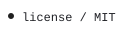
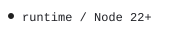

<!-- Generated with open-readme. Edit the JSON configuration to regenerate. -->

<a href="https://github.com/luc3xhj/open-readme/blob/main/LICENSE">
<picture>
  <source media="(prefers-color-scheme: dark) and (max-width: 840px)" srcset="assets/open-readme/status-1-dark-mobile.svg">
  <source media="(max-width: 840px)" srcset="assets/open-readme/status-1-light-mobile.svg">
  <source media="(prefers-color-scheme: dark)" srcset="assets/open-readme/status-1-dark.svg">
  
</picture>
</a>
<picture>
  <source media="(prefers-color-scheme: dark) and (max-width: 840px)" srcset="assets/open-readme/status-2-dark-mobile.svg">
  <source media="(max-width: 840px)" srcset="assets/open-readme/status-2-light-mobile.svg">
  <source media="(prefers-color-scheme: dark)" srcset="assets/open-readme/status-2-dark.svg">
  
</picture>
<picture>
  <source media="(prefers-color-scheme: dark) and (max-width: 840px)" srcset="assets/open-readme/status-3-dark-mobile.svg">
  <source media="(max-width: 840px)" srcset="assets/open-readme/status-3-light-mobile.svg">
  <source media="(prefers-color-scheme: dark)" srcset="assets/open-readme/status-3-dark.svg">
  
</picture>
