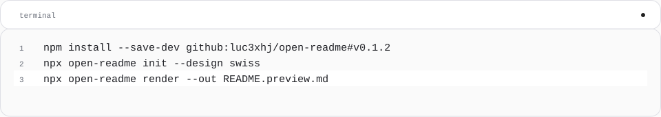

<!-- Generated with open-readme. Edit the JSON configuration to regenerate. -->

## Quick start

<picture>
  <source media="(prefers-color-scheme: dark) and (max-width: 840px)" srcset="assets/open-readme/quickstart-dark-mobile.svg">
  <source media="(max-width: 840px)" srcset="assets/open-readme/quickstart-light-mobile.svg">
  <source media="(prefers-color-scheme: dark)" srcset="assets/open-readme/quickstart-dark.svg">
  
</picture>

<details>
<summary>Copyable command / source</summary>

```sh
npm install --save-dev github:luc3xhj/open-readme#v0.2.1
npx open-readme init --design swiss
npx open-readme render --out README.preview.md
```

</details>
