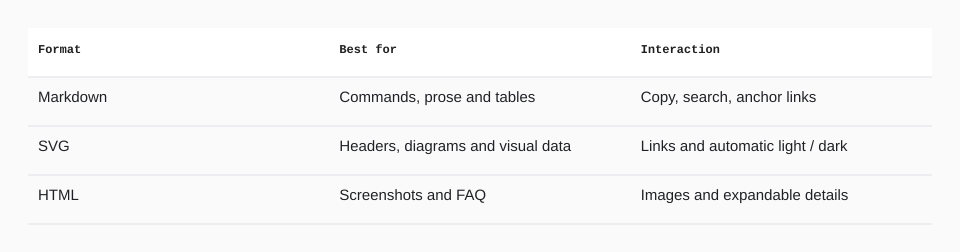

<!-- Generated with open-readme. Edit the JSON configuration to regenerate. -->

## Pick the output that fits

<picture>
  <source media="(prefers-color-scheme: dark) and (max-width: 840px)" srcset="assets/open-readme/formats-dark-mobile.svg">
  <source media="(max-width: 840px)" srcset="assets/open-readme/formats-light-mobile.svg">
  <source media="(prefers-color-scheme: dark)" srcset="assets/open-readme/formats-dark.svg">
  
</picture>

View the table as text

| Format | Best for | Interaction |
| --- | --- | --- |
| Markdown | Commands, prose and tables | Copy, search, anchor links |
| SVG | Headers, diagrams and visual data | Links and automatic light / dark |
| HTML | Screenshots and FAQ | Images and expandable details |

