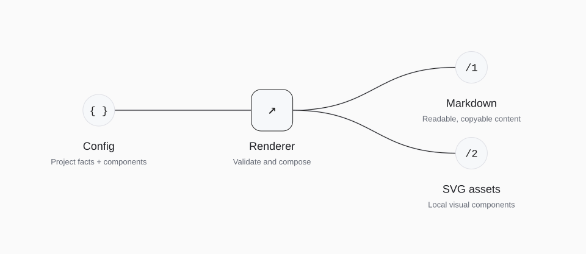

<!-- Generated with open-readme. Edit the JSON configuration to regenerate. -->

## How the output is built

<picture>
  <source media="(prefers-color-scheme: dark) and (max-width: 840px)" srcset="assets/open-readme/architecture-dark-mobile.svg">
  <source media="(max-width: 840px)" srcset="assets/open-readme/architecture-light-mobile.svg">
  <source media="(prefers-color-scheme: dark)" srcset="assets/open-readme/architecture-dark.svg">
  
</picture>

Diagram description

- **Config** — Project facts + components
- **Renderer** — Validate and compose
- **Markdown** — Readable, copyable content
- **SVG assets** — Local visual components

