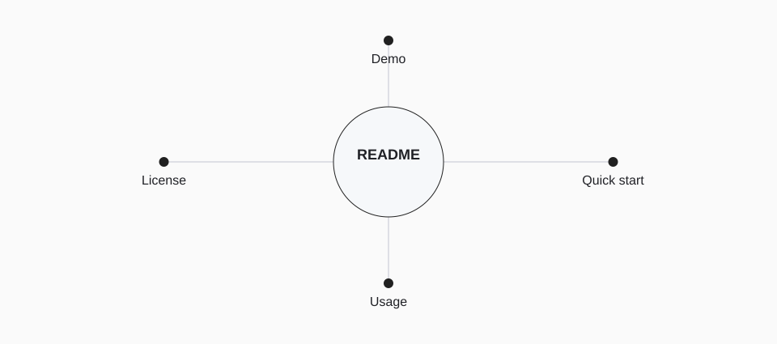

<!-- Generated with open-readme. Edit the JSON configuration to regenerate. -->

## A reader’s route through the README

<picture>
  <source media="(prefers-color-scheme: dark) and (max-width: 840px)" srcset="assets/open-readme/architecture-dark-mobile.svg">
  <source media="(max-width: 840px)" srcset="assets/open-readme/architecture-light-mobile.svg">
  <source media="(prefers-color-scheme: dark)" srcset="assets/open-readme/architecture-dark.svg">
  
</picture>

Diagram description

- **Demo** — Show the result
- **Quick start** — Get running
- **Usage** — Complete a task
- **License** — Know the terms

