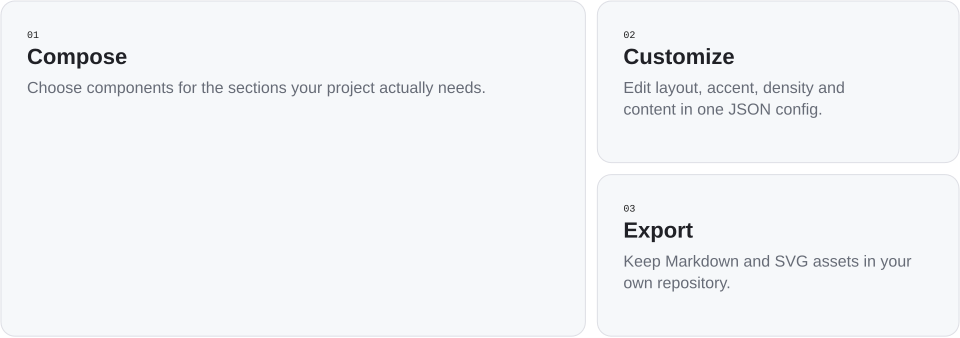

<!-- Generated with open-readme. Edit the JSON configuration to regenerate. -->

## What your agent can build

<picture>
  <source media="(prefers-color-scheme: dark) and (max-width: 840px)" srcset="assets/open-readme/features-dark-mobile.svg">
  <source media="(max-width: 840px)" srcset="assets/open-readme/features-light-mobile.svg">
  <source media="(prefers-color-scheme: dark)" srcset="assets/open-readme/features-dark.svg">
  
</picture>

<details>
<summary>Feature examples</summary>

**Compose for your project** — Choose sections for a CLI, library, app or dataset. Keep the facts your reader needs.

```text
project facts → useful sections → README
```

**Edit the design in JSON** — Change layout, accent and density in a versioned configuration.

```text
"design": "canvas"
"style": {"accent": "#6657D8"}
```

**Keep commands copyable** — Installation and usage examples export as real Markdown code.

```text
npx open-readme render --out README.preview.md
```

**Own the result** — Commit your Markdown and local SVGs together. No hosted image service is required.

```text
README.md
assets/open-readme/
  hero-light.svg
  hero-dark.svg
```

</details>
