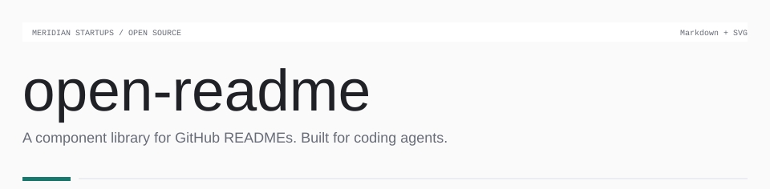

<!-- Generated with open-readme. Edit the JSON configuration to regenerate. -->

<picture>
  <source media="(prefers-color-scheme: dark) and (max-width: 840px)" srcset="assets/open-readme/hero-dark-mobile.svg">
  <source media="(max-width: 840px)" srcset="assets/open-readme/hero-light-mobile.svg">
  <source media="(prefers-color-scheme: dark)" srcset="assets/open-readme/hero-dark.svg">
  
</picture>
