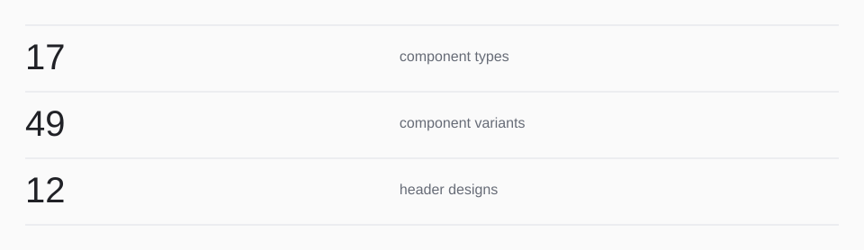

<!-- Generated with open-readme. Edit the JSON configuration to regenerate. -->

## The component catalog

<picture>
  <source media="(prefers-color-scheme: dark) and (max-width: 840px)" srcset="assets/open-readme/catalog-size-dark-mobile.svg">
  <source media="(max-width: 840px)" srcset="assets/open-readme/catalog-size-light-mobile.svg">
  <source media="(prefers-color-scheme: dark)" srcset="assets/open-readme/catalog-size-dark.svg">
  
</picture>

17 component types ([source](<https://github.com/luc3xhj/open-readme/blob/main/src/variants.js>)) · 52 component variants ([source](<https://github.com/luc3xhj/open-readme/blob/main/src/variants.js>)) · 12 header designs ([source](<https://github.com/luc3xhj/open-readme/blob/main/src/designs.js>))

Counts describe this release’s catalog; these are not fetched GitHub statistics.
