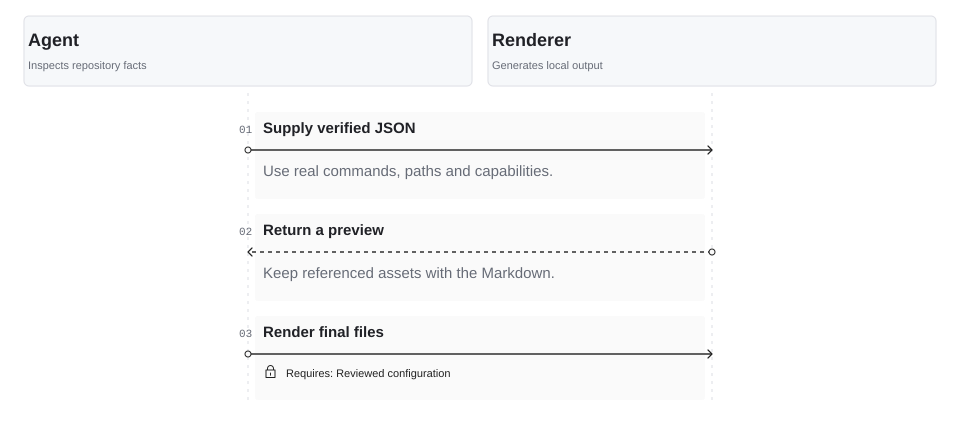

<!-- Generated with open-readme. Edit the JSON configuration to regenerate. -->

## Review before writing

<picture>
  <source media="(prefers-color-scheme: dark) and (max-width: 840px)" srcset="assets/open-readme/interaction-dark-mobile.svg">
  <source media="(max-width: 840px)" srcset="assets/open-readme/interaction-light-mobile.svg">
  <source media="(prefers-color-scheme: dark)" srcset="assets/open-readme/interaction-dark.svg">
  
</picture>

Read the diagram as text

- 1. Agent → Renderer: Supply verified JSON — Use real commands, paths and capabilities.
- 2. Renderer → Agent: Return a preview — Keep referenced assets with the Markdown.
- 3. Agent → Renderer: Render final files \[Requires: Reviewed configuration\]

