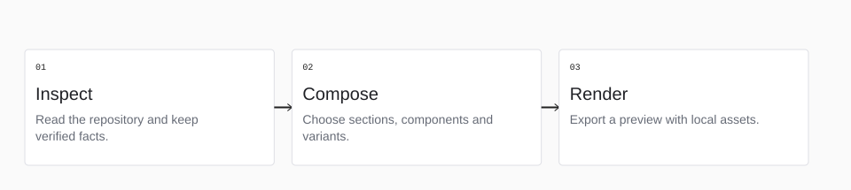

<!-- Generated with open-readme. Edit the JSON configuration to regenerate. -->

## From your project to a README

<picture>
  <source media="(prefers-color-scheme: dark) and (max-width: 840px)" srcset="assets/open-readme/workflow-dark-mobile.svg">
  <source media="(max-width: 840px)" srcset="assets/open-readme/workflow-light-mobile.svg">
  <source media="(prefers-color-scheme: dark)" srcset="assets/open-readme/workflow-dark.svg">
  
</picture>

1. **Inspect**

   Read the repository and keep verified facts.

2. **Compose**

   Choose sections, components and variants.

3. **Render**

   Export a preview with local assets.
