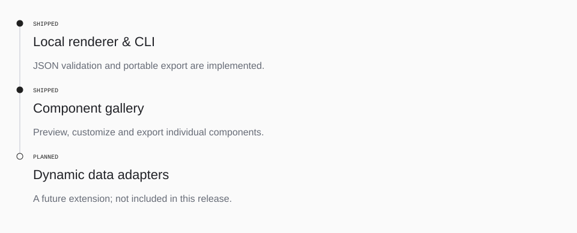

<!-- Generated with open-readme. Edit the JSON configuration to regenerate. -->

## Build status

<picture>
  <source media="(prefers-color-scheme: dark) and (max-width: 840px)" srcset="assets/open-readme/roadmap-dark-mobile.svg">
  <source media="(max-width: 840px)" srcset="assets/open-readme/roadmap-light-mobile.svg">
  <source media="(prefers-color-scheme: dark)" srcset="assets/open-readme/roadmap-dark.svg">
  
</picture>

Roadmap as text

- [x] **Local renderer & CLI** (shipped) — JSON validation and portable export are implemented.
- [x] **Component gallery** (shipped) — Preview, customize and export individual components.
- [ ] **Dynamic data adapters** (planned) — A future extension; not included in this release.

