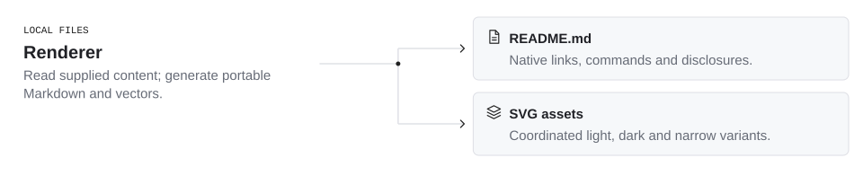

<!-- Generated with open-readme. Edit the JSON configuration to regenerate. -->

## From config to repository

<picture>
  <source media="(prefers-color-scheme: dark) and (max-width: 840px)" srcset="assets/open-readme/system-dark-mobile.svg">
  <source media="(max-width: 840px)" srcset="assets/open-readme/system-light-mobile.svg">
  <source media="(prefers-color-scheme: dark)" srcset="assets/open-readme/system-dark.svg">
  
</picture>

Read the diagram as text

- Renderer (LOCAL FILES): Read supplied content; generate portable Markdown and vectors.
- Renderer → README.md: Native links, commands and disclosures.
- Renderer → SVG assets: Coordinated light, dark and narrow variants.

