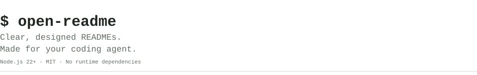
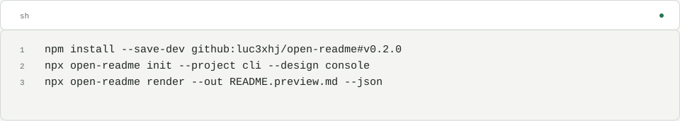
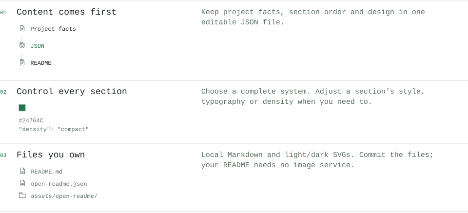
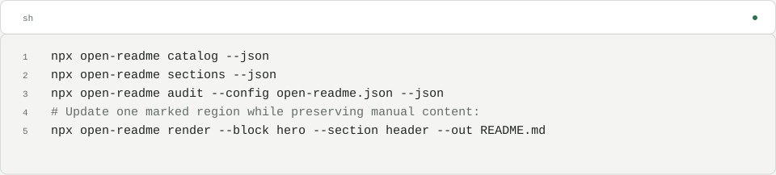
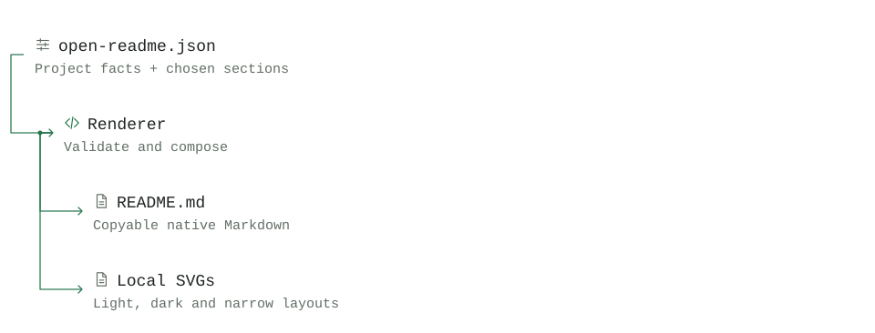

<!-- Generated with open-readme. Edit the JSON configuration to regenerate. -->

<picture>
  <source media="(prefers-color-scheme: dark) and (max-width: 840px)" srcset="assets/open-readme/hero-dark-mobile.svg">
  <source media="(max-width: 840px)" srcset="assets/open-readme/hero-light-mobile.svg">
  <source media="(prefers-color-scheme: dark)" srcset="assets/open-readme/hero-dark.svg">
  
</picture>

<details>
<summary>Preview source</summary>

```text
README.preview.md
assets/open-readme/
  hero-light.svg
  hero-dark.svg
```

</details>

[README designs](<https://luc3xhj.github.io/open-readme/>) · [Agent skill](<./skills/open-readme/SKILL.md>) · [Section guide](<./docs/sections.md>) · [Configuration](<./docs/configuration.md>)

<p>
<a href="./LICENSE"><picture><source media="(prefers-color-scheme: dark) and (max-width: 840px)" srcset="assets/open-readme/status-1-dark-mobile.svg"><source media="(max-width: 840px)" srcset="assets/open-readme/status-1-light-mobile.svg"><source media="(prefers-color-scheme: dark)" srcset="assets/open-readme/status-1-dark.svg"></picture></a>
<picture>
  <source media="(prefers-color-scheme: dark) and (max-width: 840px)" srcset="assets/open-readme/status-2-dark-mobile.svg">
  <source media="(max-width: 840px)" srcset="assets/open-readme/status-2-light-mobile.svg">
  <source media="(prefers-color-scheme: dark)" srcset="assets/open-readme/status-2-dark.svg">
  
</picture>
<picture>
  <source media="(prefers-color-scheme: dark) and (max-width: 840px)" srcset="assets/open-readme/status-3-dark-mobile.svg">
  <source media="(max-width: 840px)" srcset="assets/open-readme/status-3-light-mobile.svg">
  <source media="(prefers-color-scheme: dark)" srcset="assets/open-readme/status-3-dark.svg">
  
</picture>
</p>

## Quick start

<picture>
  <source media="(prefers-color-scheme: dark) and (max-width: 840px)" srcset="assets/open-readme/quickstart-dark-mobile.svg">
  <source media="(max-width: 840px)" srcset="assets/open-readme/quickstart-light-mobile.svg">
  <source media="(prefers-color-scheme: dark)" srcset="assets/open-readme/quickstart-dark.svg">
  
</picture>

<details>
<summary>Copyable command / source</summary>

```sh
npm install --save-dev github:luc3xhj/open-readme#v0.2.0
npx open-readme init --project cli --design console
npx open-readme render --out README.preview.md --json
```

</details>

Requires Node.js 22+. Edit the starter with your project’s facts, then commit the preview and its assets. Installation is from GitHub; the npm package is not published.

## What your agent can build

<picture>
  <source media="(prefers-color-scheme: dark) and (max-width: 840px)" srcset="assets/open-readme/features-dark-mobile.svg">
  <source media="(max-width: 840px)" srcset="assets/open-readme/features-light-mobile.svg">
  <source media="(prefers-color-scheme: dark)" srcset="assets/open-readme/features-dark.svg">
  
</picture>

<details>
<summary>Feature examples</summary>

**Compose for your project** — Choose sections for a CLI, library, app or dataset. Keep the facts your reader needs.

```text
project facts → useful sections → README
```

**Edit the design in JSON** — Change layout, accent and density in a versioned configuration.

```text
"design": "canvas"
"style": {"accent": "#6657D8"}
```

**Keep commands copyable** — Installation and usage examples export as real Markdown code.

```text
npx open-readme render --out README.preview.md
```

**Own the result** — Commit your Markdown and local SVGs together. No hosted image service is required.

```text
README.md
assets/open-readme/
  hero-light.svg
  hero-dark.svg
```

</details>

## Use with your agent

Load [skills/open-readme/SKILL.md](./skills/open-readme/SKILL.md), then ask:

> Use open-readme for this repository. Inspect the project, choose useful sections, and show me two complete README designs. Keep commands copyable, use a real demo image if available, and omit unsupported claims. Render to README.preview.md first.

The agent can inspect the catalog and section guide through the CLI:

<picture>
  <source media="(prefers-color-scheme: dark) and (max-width: 840px)" srcset="assets/open-readme/commands-dark-mobile.svg">
  <source media="(max-width: 840px)" srcset="assets/open-readme/commands-light-mobile.svg">
  <source media="(prefers-color-scheme: dark)" srcset="assets/open-readme/commands-dark.svg">
  
</picture>

<details>
<summary>Copyable command / source</summary>

```sh
npx open-readme catalog --json
npx open-readme sections --json
npx open-readme audit --config open-readme.json --json
# Update one marked region while preserving manual content:
npx open-readme render --block hero --section header --out README.md
```

</details>

## How it fits together

<picture>
  <source media="(prefers-color-scheme: dark) and (max-width: 840px)" srcset="assets/open-readme/architecture-dark-mobile.svg">
  <source media="(max-width: 840px)" srcset="assets/open-readme/architecture-light-mobile.svg">
  <source media="(prefers-color-scheme: dark)" srcset="assets/open-readme/architecture-dark.svg">
  
</picture>

<details>
<summary>Diagram description</summary>

- **Project config** — Facts + chosen sections
- **Renderer** — Validate and compose
- **README.md** — Readable, copyable Markdown
- **SVG assets** — Local light / dark visuals

</details>

<details>
<summary>What works inside a GitHub README?</summary>

Links, anchor navigation, expandable details, GitHub’s code-copy controls and automatic light / dark images work. Browser-style JavaScript tabs, hover effects, forms and embedded apps do not run inside GitHub Markdown. Code groups therefore export as native disclosures.

Designed SVGs keep their text in accessible descriptions; commands, prose and reference tables remain available as selectable Markdown. Metrics are supplied values with sources, not live statistics.

The [component library](https://luc3xhj.github.io/open-readme/) previews individual variants, supports editable JSON, and exports components or complete README bundles. [Design notes](./docs/design-notes.md) document the inspiration and GitHub adaptations.

</details>

## Contributing

[Suggest a component](https://github.com/luc3xhj/open-readme/issues) or read [CONTRIBUTING.md](./CONTRIBUTING.md). A component should solve a reader’s problem, expose meaningful configuration and work in the exported README.

## License

MIT. See [LICENSE](./LICENSE). Built by [Lucas](https://github.com/luc3xhj) at [Meridian Startups](https://meridianstartups.com).
