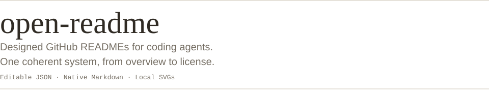
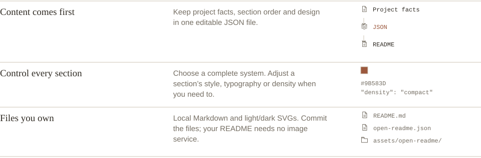
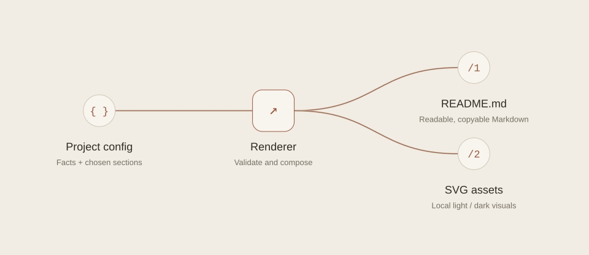

<!-- Generated with open-readme. Edit the JSON configuration to regenerate. -->

<picture>
  <source media="(prefers-color-scheme: dark) and (max-width: 520px)" srcset="assets/open-readme/hero-dark-mobile.svg">
  <source media="(max-width: 520px)" srcset="assets/open-readme/hero-light-mobile.svg">
  <source media="(prefers-color-scheme: dark) and (max-width: 840px)" srcset="assets/open-readme/hero-dark-compact.svg">
  <source media="(max-width: 840px)" srcset="assets/open-readme/hero-light-compact.svg">
  <source media="(prefers-color-scheme: dark)" srcset="assets/open-readme/hero-dark.svg">
  
</picture>

<a id="built-for-the-whole-readme"></a>
<h2>
<picture>
  <source media="(prefers-color-scheme: dark) and (max-width: 520px)" srcset="assets/open-readme/features__heading-dark-mobile.svg">
  <source media="(max-width: 520px)" srcset="assets/open-readme/features__heading-light-mobile.svg">
  <source media="(prefers-color-scheme: dark) and (max-width: 840px)" srcset="assets/open-readme/features__heading-dark-compact.svg">
  <source media="(max-width: 840px)" srcset="assets/open-readme/features__heading-light-compact.svg">
  <source media="(prefers-color-scheme: dark)" srcset="assets/open-readme/features__heading-dark.svg">
  
</picture>
</h2>

<picture>
  <source media="(prefers-color-scheme: dark) and (max-width: 520px)" srcset="assets/open-readme/features-dark-mobile.svg">
  <source media="(max-width: 520px)" srcset="assets/open-readme/features-light-mobile.svg">
  <source media="(prefers-color-scheme: dark) and (max-width: 840px)" srcset="assets/open-readme/features-dark-compact.svg">
  <source media="(max-width: 840px)" srcset="assets/open-readme/features-light-compact.svg">
  <source media="(prefers-color-scheme: dark)" srcset="assets/open-readme/features-dark.svg">
  
</picture>

<a id="get-started"></a>
<h2>
<picture>
  <source media="(prefers-color-scheme: dark) and (max-width: 520px)" srcset="assets/open-readme/quickstart__heading-dark-mobile.svg">
  <source media="(max-width: 520px)" srcset="assets/open-readme/quickstart__heading-light-mobile.svg">
  <source media="(prefers-color-scheme: dark) and (max-width: 840px)" srcset="assets/open-readme/quickstart__heading-dark-compact.svg">
  <source media="(max-width: 840px)" srcset="assets/open-readme/quickstart__heading-light-compact.svg">
  <source media="(prefers-color-scheme: dark)" srcset="assets/open-readme/quickstart__heading-dark.svg">
  
</picture>
</h2>

```sh
npm install --save-dev github:luc3xhj/open-readme#v0.3.0
npx open-readme init --project cli --design journal
npx open-readme render --out README.preview.md --json
```

Requires Node.js 22+. Edit the starter with your project’s facts before rendering.

<a id="use-with-your-agent"></a>
<h2>
<picture>
  <source media="(prefers-color-scheme: dark) and (max-width: 520px)" srcset="assets/open-readme/agent__heading-dark-mobile.svg">
  <source media="(max-width: 520px)" srcset="assets/open-readme/agent__heading-light-mobile.svg">
  <source media="(prefers-color-scheme: dark) and (max-width: 840px)" srcset="assets/open-readme/agent__heading-dark-compact.svg">
  <source media="(max-width: 840px)" srcset="assets/open-readme/agent__heading-light-compact.svg">
  <source media="(prefers-color-scheme: dark)" srcset="assets/open-readme/agent__heading-dark.svg">
  
</picture>
</h2>

Load the [agent skill](https://github.com/luc3xhj/open-readme/blob/main/skills/open-readme/SKILL.md), then ask:

> Design this repository’s README with open-readme. Verify the install and usage commands. Choose the useful sections, show me two complete design systems, and render to README.preview.md first.

Your agent inspects the repository, edits the config and runs the CLI. Review the result before replacing your README.

<a id="make-it-yours"></a>
<h2>
<picture>
  <source media="(prefers-color-scheme: dark) and (max-width: 520px)" srcset="assets/open-readme/configuration__heading-dark-mobile.svg">
  <source media="(max-width: 520px)" srcset="assets/open-readme/configuration__heading-light-mobile.svg">
  <source media="(prefers-color-scheme: dark) and (max-width: 840px)" srcset="assets/open-readme/configuration__heading-dark-compact.svg">
  <source media="(max-width: 840px)" srcset="assets/open-readme/configuration__heading-light-compact.svg">
  <source media="(prefers-color-scheme: dark)" srcset="assets/open-readme/configuration__heading-dark.svg">
  
</picture>
</h2>

**Option: design**

Default: plain · Controls: The complete design system

**Option: style.accent**

Default: Design default · Controls: Color across sections

**Option: style.density**

Default: compact · Controls: Spacing in SVG sections

**Option: block.design**

Default: Inherited · Controls: One section’s design variant

```json
{
  "design": "journal",
  "style": {
    "accent": "#9B583D",
    "density": "compact"
  }
}
```

A config fragment. Edit the ordered blocks to change your sections.

<a id="how-it-works"></a>
<h2>
<picture>
  <source media="(prefers-color-scheme: dark) and (max-width: 520px)" srcset="assets/open-readme/architecture__heading-dark-mobile.svg">
  <source media="(max-width: 520px)" srcset="assets/open-readme/architecture__heading-light-mobile.svg">
  <source media="(prefers-color-scheme: dark) and (max-width: 840px)" srcset="assets/open-readme/architecture__heading-dark-compact.svg">
  <source media="(max-width: 840px)" srcset="assets/open-readme/architecture__heading-light-compact.svg">
  <source media="(prefers-color-scheme: dark)" srcset="assets/open-readme/architecture__heading-dark.svg">
  
</picture>
</h2>

<picture>
  <source media="(prefers-color-scheme: dark) and (max-width: 520px)" srcset="assets/open-readme/architecture-dark-mobile.svg">
  <source media="(max-width: 520px)" srcset="assets/open-readme/architecture-light-mobile.svg">
  <source media="(prefers-color-scheme: dark) and (max-width: 840px)" srcset="assets/open-readme/architecture-dark-compact.svg">
  <source media="(max-width: 840px)" srcset="assets/open-readme/architecture-light-compact.svg">
  <source media="(prefers-color-scheme: dark)" srcset="assets/open-readme/architecture-dark.svg">
  
</picture>

<a id="use-it-in-code"></a>
<h2>
<picture>
  <source media="(prefers-color-scheme: dark) and (max-width: 520px)" srcset="assets/open-readme/api__heading-dark-mobile.svg">
  <source media="(max-width: 520px)" srcset="assets/open-readme/api__heading-light-mobile.svg">
  <source media="(prefers-color-scheme: dark) and (max-width: 840px)" srcset="assets/open-readme/api__heading-dark-compact.svg">
  <source media="(max-width: 840px)" srcset="assets/open-readme/api__heading-light-compact.svg">
  <source media="(prefers-color-scheme: dark)" srcset="assets/open-readme/api__heading-dark.svg">
  
</picture>
</h2>

```js
import { render } from "@luc3xhj/open-readme";

const { markdown, assets } = render(config);
// assets is a Map of local SVG filenames and contents.
```

The CLI and browser use this same renderer. The output has no runtime dependency.

<a id="works-on-github"></a>
<h2>
<picture>
  <source media="(prefers-color-scheme: dark) and (max-width: 520px)" srcset="assets/open-readme/compatibility__heading-dark-mobile.svg">
  <source media="(max-width: 520px)" srcset="assets/open-readme/compatibility__heading-light-mobile.svg">
  <source media="(prefers-color-scheme: dark) and (max-width: 840px)" srcset="assets/open-readme/compatibility__heading-dark-compact.svg">
  <source media="(max-width: 840px)" srcset="assets/open-readme/compatibility__heading-light-compact.svg">
  <source media="(prefers-color-scheme: dark)" srcset="assets/open-readme/compatibility__heading-dark.svg">
  
</picture>
</h2>

Commands, prose, tables and links stay selectable. GitHub switches the light and dark images automatically. Commit `README.md` and `assets/open-readme/` together.

JavaScript widgets and hover animation do not run in a GitHub README. The export uses native interactions and static SVGs.

Read the [configuration reference](https://github.com/luc3xhj/open-readme/blob/main/docs/configuration.md) and [section guide](https://github.com/luc3xhj/open-readme/blob/main/docs/sections.md).

<a id="contribute"></a>
<h2>
<picture>
  <source media="(prefers-color-scheme: dark) and (max-width: 520px)" srcset="assets/open-readme/contributing__heading-dark-mobile.svg">
  <source media="(max-width: 520px)" srcset="assets/open-readme/contributing__heading-light-mobile.svg">
  <source media="(prefers-color-scheme: dark) and (max-width: 840px)" srcset="assets/open-readme/contributing__heading-dark-compact.svg">
  <source media="(max-width: 840px)" srcset="assets/open-readme/contributing__heading-light-compact.svg">
  <source media="(prefers-color-scheme: dark)" srcset="assets/open-readme/contributing__heading-dark.svg">
  
</picture>
</h2>

[Report an issue](https://github.com/luc3xhj/open-readme/issues) or read the [contribution guide](https://github.com/luc3xhj/open-readme/blob/main/CONTRIBUTING.md). Design a section around a reader’s task, then check it within the complete README.

<a id="license--credits"></a>
<h2>
<picture>
  <source media="(prefers-color-scheme: dark) and (max-width: 520px)" srcset="assets/open-readme/license__heading-dark-mobile.svg">
  <source media="(max-width: 520px)" srcset="assets/open-readme/license__heading-light-mobile.svg">
  <source media="(prefers-color-scheme: dark) and (max-width: 840px)" srcset="assets/open-readme/license__heading-dark-compact.svg">
  <source media="(max-width: 840px)" srcset="assets/open-readme/license__heading-light-compact.svg">
  <source media="(prefers-color-scheme: dark)" srcset="assets/open-readme/license__heading-dark.svg">
  
</picture>
</h2>

[MIT](https://github.com/luc3xhj/open-readme/blob/main/LICENSE). Built by [Lucas](https://github.com/luc3xhj) at [Meridian Startups](https://meridianstartups.com). [Preview the complete designs](https://luc3xhj.github.io/open-readme/).
