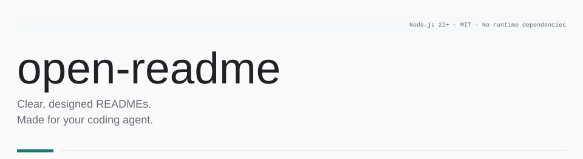
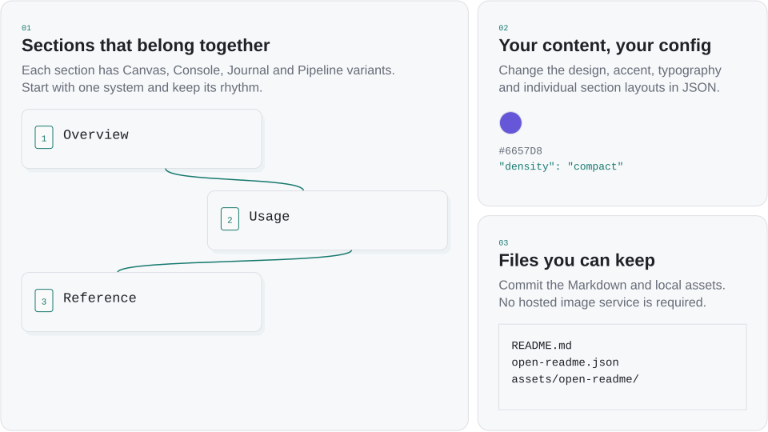
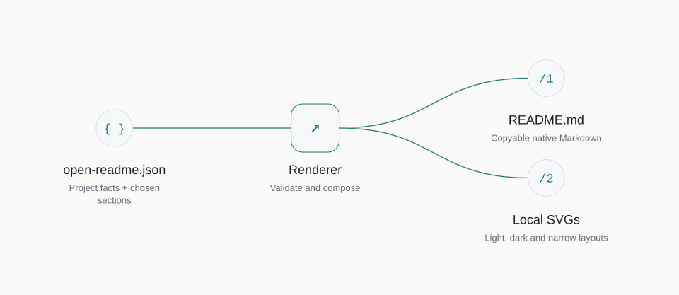

<!-- Generated with open-readme. Edit the JSON configuration to regenerate. -->

<picture>
  <source media="(prefers-color-scheme: dark) and (max-width: 840px)" srcset="assets/open-readme/hero-dark-mobile.svg">
  <source media="(max-width: 840px)" srcset="assets/open-readme/hero-light-mobile.svg">
  <source media="(prefers-color-scheme: dark)" srcset="assets/open-readme/hero-dark.svg">
  
</picture>

## Built for the whole README

<picture>
  <source media="(prefers-color-scheme: dark) and (max-width: 840px)" srcset="assets/open-readme/features-dark-mobile.svg">
  <source media="(max-width: 840px)" srcset="assets/open-readme/features-light-mobile.svg">
  <source media="(prefers-color-scheme: dark)" srcset="assets/open-readme/features-dark.svg">
  
</picture>

## Get started

```sh
npm install --save-dev github:luc3xhj/open-readme#v0.3.2
npx open-readme init --project cli --design canvas
npx open-readme render --out README.preview.md --json
```

Requires Node.js 22+. Edit the starter with your project’s facts before rendering.

## Use with your agent

Load the [agent skill](./skills/open-readme/SKILL.md), then ask:

> Design this repository’s README with open-readme. Verify the install and usage commands. Choose the useful sections, show me two complete design systems, and render to README.preview.md first.

Your agent inspects the repository, edits the config and runs the CLI. Review the result before replacing your README.

## Make it yours

| Option | Default | Controls |
| --- | --- | --- |
| design | plain | The complete design system |
| style.accent | Design default | Color across sections |
| style.density | compact | Spacing in SVG sections |
| block.design | Inherited | One section’s design variant |

```json
{
  "design": "canvas",
  "style": { "accent": "#6657D8", "density": "compact" }
}
```

A config fragment. Edit the ordered blocks to change your sections.

## How it works

<picture>
  <source media="(prefers-color-scheme: dark) and (max-width: 840px)" srcset="assets/open-readme/architecture-dark-mobile.svg">
  <source media="(max-width: 840px)" srcset="assets/open-readme/architecture-light-mobile.svg">
  <source media="(prefers-color-scheme: dark)" srcset="assets/open-readme/architecture-dark.svg">
  
</picture>

<details>
<summary>Diagram description</summary>

open-readme.json → Renderer; parallel outputs: README.md, Local SVGs

- **open-readme.json** — Project facts + chosen sections
- **Renderer** — Validate and compose
- **README.md** — Copyable native Markdown
- **Local SVGs** — Light, dark and narrow layouts

</details>

## Use it in code

```js
import { render } from "@luc3xhj/open-readme";

const { markdown, assets } = render(config);
// assets is a Map of local SVG filenames and contents.
```

The CLI and browser use this same renderer. The output has no runtime dependency.

## Works on GitHub

Commands, prose, tables and links stay selectable. GitHub switches the light and dark images automatically. Commit `README.md` and `assets/open-readme/` together.

JavaScript widgets and hover animation do not run in a GitHub README. The export uses native interactions and static SVGs.

Read the [configuration reference](./docs/configuration.md) and [section guide](./docs/sections.md).

## Contribute

[Report an issue](https://github.com/luc3xhj/open-readme/issues) or read the [contribution guide](./CONTRIBUTING.md). Design a section around a reader’s task, then check it within the complete README.

## License & credits

[MIT](./LICENSE). Built by [Lucas](https://github.com/luc3xhj) at [Meridian Startups](https://meridianstartups.com). [Preview the complete designs](https://luc3xhj.github.io/open-readme/).
