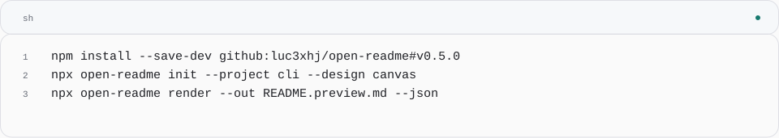
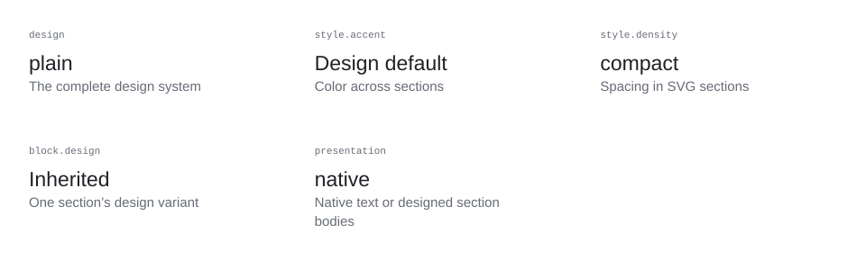
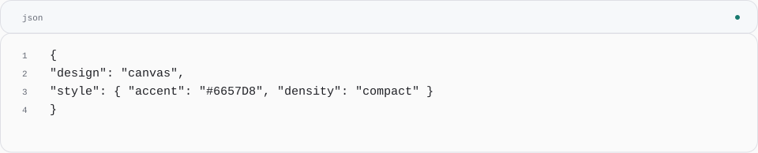
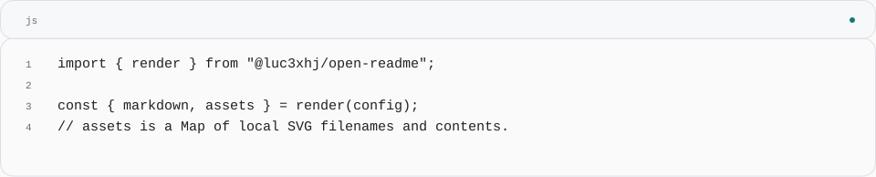

<!-- Generated with open-readme. Edit the JSON configuration to regenerate. -->

<picture>
  <source media="(prefers-color-scheme: dark) and (max-width: 840px)" srcset="assets/open-readme/hero-dark-mobile.svg">
  <source media="(max-width: 840px)" srcset="assets/open-readme/hero-light-mobile.svg">
  <source media="(prefers-color-scheme: dark)" srcset="assets/open-readme/hero-dark.svg">
  
</picture>

## What you get

<picture>
  <source media="(prefers-color-scheme: dark) and (max-width: 840px)" srcset="assets/open-readme/features-dark-mobile.svg">
  <source media="(max-width: 840px)" srcset="assets/open-readme/features-light-mobile.svg">
  <source media="(prefers-color-scheme: dark)" srcset="assets/open-readme/features-dark.svg">
  
</picture>

## Get started

<picture>
  <source media="(prefers-color-scheme: dark) and (max-width: 840px)" srcset="assets/open-readme/quickstart-dark-mobile.svg">
  <source media="(max-width: 840px)" srcset="assets/open-readme/quickstart-light-mobile.svg">
  <source media="(prefers-color-scheme: dark)" srcset="assets/open-readme/quickstart-dark.svg">
  
</picture>

<details>
<summary>Code</summary>

```sh
npm install --save-dev github:luc3xhj/open-readme#v0.5.0
npx open-readme init --project cli --design canvas
npx open-readme render --out README.preview.md --json
```

</details>

<sub>Node.js 22+. Fill in your project’s facts, then render a preview.</sub>

## Use with your agent

Load the [agent skill](./skills/open-readme/SKILL.md), then ask:

> Design this repository’s README with open-readme. Verify the install and usage commands. Choose the useful sections, show me two complete design systems, and render to README.preview.md first.

Your agent inspects the repository, edits the config and runs the CLI. Review the result before replacing your README.

## Configuration

<picture>
  <source media="(prefers-color-scheme: dark) and (max-width: 840px)" srcset="assets/open-readme/configuration-dark-mobile.svg">
  <source media="(max-width: 840px)" srcset="assets/open-readme/configuration-light-mobile.svg">
  <source media="(prefers-color-scheme: dark)" srcset="assets/open-readme/configuration-dark.svg">
  
</picture>

<details>
<summary>View the table as text</summary>

| Option | Default | Controls |
| --- | --- | --- |
| design | plain | The complete design system |
| style.accent | Design default | Color across sections |
| style.density | compact | Spacing in SVG sections |
| block.design | Inherited | One section’s design variant |
| presentation | native | Native text or designed section bodies |

</details>

<picture>
  <source media="(prefers-color-scheme: dark) and (max-width: 840px)" srcset="assets/open-readme/customize-dark-mobile.svg">
  <source media="(max-width: 840px)" srcset="assets/open-readme/customize-light-mobile.svg">
  <source media="(prefers-color-scheme: dark)" srcset="assets/open-readme/customize-dark.svg">
  
</picture>

<details>
<summary>Code</summary>

```json
{
  "design": "canvas",
  "style": { "accent": "#6657D8", "density": "compact" }
}
```

</details>

<sub>Override the complete system or one block. Your content stays in the same config.</sub>

## Rendering pipeline

<picture>
  <source media="(prefers-color-scheme: dark) and (max-width: 840px)" srcset="assets/open-readme/architecture-dark-mobile.svg">
  <source media="(max-width: 840px)" srcset="assets/open-readme/architecture-light-mobile.svg">
  <source media="(prefers-color-scheme: dark)" srcset="assets/open-readme/architecture-dark.svg">
  
</picture>

<details>
<summary>Diagram description</summary>

open-readme.json → Renderer; parallel outputs: README.md, Local SVGs

- **open-readme.json** — Project facts + chosen sections
- **Renderer** — Validate and compose
- **README.md** — Copyable native Markdown
- **Local SVGs** — Light, dark and narrow layouts

</details>

## JavaScript API

<picture>
  <source media="(prefers-color-scheme: dark) and (max-width: 840px)" srcset="assets/open-readme/api-dark-mobile.svg">
  <source media="(max-width: 840px)" srcset="assets/open-readme/api-light-mobile.svg">
  <source media="(prefers-color-scheme: dark)" srcset="assets/open-readme/api-dark.svg">
  
</picture>

<details>
<summary>Code</summary>

```js
import { render } from "@luc3xhj/open-readme";

const { markdown, assets } = render(config);
// assets is a Map of local SVG filenames and contents.
```

</details>

<sub>The CLI and browser use this same renderer. The output has no runtime dependency.</sub>

## Works on GitHub

Code, prose, references and links remain native Markdown. GitHub chooses light or dark SVGs automatically. Commit `README.md` and `assets/open-readme/` together.

Read the [configuration reference](./docs/configuration.md) and [section guide](./docs/sections.md).

## Contribute

[Report an issue](https://github.com/luc3xhj/open-readme/issues) or read the [contribution guide](./CONTRIBUTING.md). Design a section around a reader’s task, then check it within the complete README.

## License & credits

[MIT](./LICENSE). Built by [Lucas](https://github.com/luc3xhj) at [Meridian Startups](https://meridianstartups.com). [Preview the complete designs](https://luc3xhj.github.io/open-readme/).
