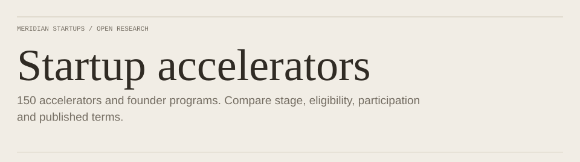
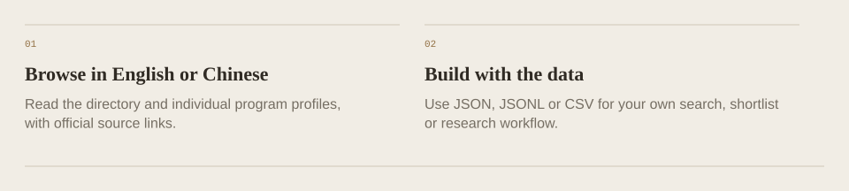

<!-- Generated with open-readme. Edit the JSON configuration to regenerate. -->

<a href="https://github.com/luc3xhj/startup-accelerators"><picture><source media="(prefers-color-scheme: dark) and (max-width: 840px)" srcset="assets/open-readme/hero-dark-mobile.svg"><source media="(max-width: 840px)" srcset="assets/open-readme/hero-light-mobile.svg"><source media="(prefers-color-scheme: dark)" srcset="assets/open-readme/hero-dark.svg"></picture></a>

[Browse directory](<https://github.com/luc3xhj/startup-accelerators>) · [Download data](<https://github.com/luc3xhj/startup-accelerators/tree/main/data>)

<picture>
  <source media="(prefers-color-scheme: dark) and (max-width: 840px)" srcset="assets/open-readme/status-1-dark-mobile.svg">
  <source media="(max-width: 840px)" srcset="assets/open-readme/status-1-light-mobile.svg">
  <source media="(prefers-color-scheme: dark)" srcset="assets/open-readme/status-1-dark.svg">
  
</picture>
<picture>
  <source media="(prefers-color-scheme: dark) and (max-width: 840px)" srcset="assets/open-readme/status-2-dark-mobile.svg">
  <source media="(max-width: 840px)" srcset="assets/open-readme/status-2-light-mobile.svg">
  <source media="(prefers-color-scheme: dark)" srcset="assets/open-readme/status-2-dark.svg">
  
</picture>
<picture>
  <source media="(prefers-color-scheme: dark) and (max-width: 840px)" srcset="assets/open-readme/status-3-dark-mobile.svg">
  <source media="(max-width: 840px)" srcset="assets/open-readme/status-3-light-mobile.svg">
  <source media="(prefers-color-scheme: dark)" srcset="assets/open-readme/status-3-dark.svg">
  
</picture>

## Use the research

<picture>
  <source media="(prefers-color-scheme: dark) and (max-width: 840px)" srcset="assets/open-readme/formats-dark-mobile.svg">
  <source media="(max-width: 840px)" srcset="assets/open-readme/formats-light-mobile.svg">
  <source media="(prefers-color-scheme: dark)" srcset="assets/open-readme/formats-dark.svg">
  
</picture>

[Browse in English or Chinese](<https://github.com/luc3xhj/startup-accelerators>) · [Build with the data](<https://github.com/luc3xhj/startup-accelerators/tree/main/data>)

Research scope

This dataset is a September 2026 research snapshot. Verify deadlines and offer terms on the linked official pages before applying. Corrections and contributions are welcome.

